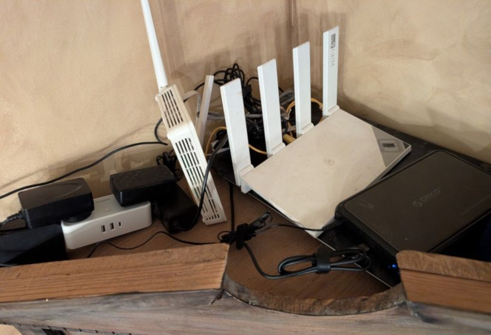
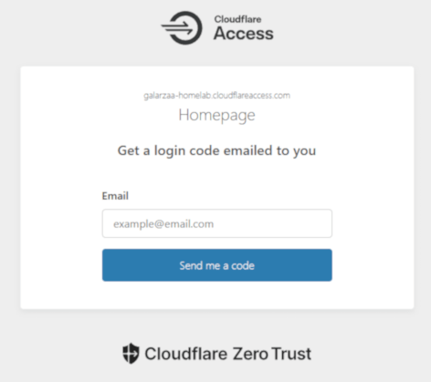

After I had set up my "[remotelab](2026-02-10-remotelab.md)" (at the time simply called homelab), the itch did not stop; it only got worse.

I wanted to add more services, but some of them were just not convenient in a VPS, especially if a lot of storage was necessary, since increasing storage on a VPS means a higher monthly payment, not to mention services that required (or worked better) being directly in my home network.

<!-- more -->

## The machine

I was set on getting one of those "mini PCs" to use as a home server. They seemed cheap and sturdy enough to be on 24/7. I definitely have no room for a server rack at home, so this seemed like a good idea. However, life has other priorities, so this was going to take some time, after all, I must first assemble a full gaming PC for the wife. So should I just wait patiently and entertain myself with something else? Of course not.

I turned to look at my old laptop[^1], it cowered in fear, mumbling *Please just let me rest. I have served you well*. I dusted it off and tried to install Ubuntu Server on it. I had a hard time trying to install it. It has two USB-A 3.0 ports, but one of them is broken, so when this laptop had Windows, I would randomly hear the device connection/disconnection sound.

The other port was fine, and it gave me no trouble when I installed Ubuntu Desktop on it because I was tired of the constant "upgrade to Windows 11! Oh wait you can't..." reminders. 

With Ubuntu Server, it was different. I would be in the last steps of the installation setup when I would get an error about device verification.

After a couple of failed attempts, I figured maybe I should use the USB-C port. I did not have a USB-C flash drive though... So I grabbed a USB-C hub, plugged the flash drive into it, and plugged it into my laptop. I was sure this was not going to work... but surprisingly, it did.

I set up the basic stuff like SSH and power options so I wouldn't lose my server as soon as I closed the lid.

Then I placed my laptop next to the router, connected to Ethernet. Oh, it was glorious, finally having a device at home taking advantage of my internet's full speed.

/// caption
Aww, my little fire hazard.
///

## The setup

The convenience of self-hosting is nothing if you're not able to access your services from anywhere, so the first thing I did was open up the important ports so I could access my server from anywhere in the world... that's what I would have said if I had done this a decade ago. Even if I wanted to do this, I wouldn't have been able to, my ISP does not give me my own public IP.

I had been reading about [Cloudflare Zero Trust](https://www.cloudflare.com/products/zero-trust/) and [Cloudflare tunnels](https://developers.cloudflare.com/cloudflare-one/networks/connectors/cloudflare-tunnel/), and I was really eager to try them, so I went ahead and set up a new Git repository for my homelab and set up a [tunnel](https://github.com/cloudflare/cloudflared).

Took me a bit getting used to the navigation on the site, but after a while I was able to spin up a nice setup. Their policies management was nice, being able to decide which services are only for me, and which I can allow my family to use.

/// caption
Cloudflare Zero Trust's login page.
///

There are 3 services I was most interested in setting up: Home Assistant, AdGuard Home, and Plex.

### Home Assistant

[Home Assistant](https://www.home-assistant.io/) is an open-source home automation platform designed to integrate and control smart devices locally. I have a couple of "smart devices" at home, but sadly they are of different brands, so that means I need to install different apps to control them.

The Alexa app helps a bit, but to be honest, it is terrible. It is slow and difficult to navigate.

Google Home's app is slightly better, but fewer devices support it, although it is nice that you can control devices from the web app.

On the other hand, Home Assistant has a stupidly long list of integrations and lets you create custom dashboards, schedules, and automations.

### AdGuard Home

[AdGuard Home](https://adguard.com/en/adguard-home/overview.html) is a network-wide DNS-based ad blocker. This is one of those things that is nice to have and easy to forget exists. I had previously used [Pi-hole](https://pi-hole.net/) when I was running a Raspberry Pi on my network. I don't really know how much of a difference it makes at home when it comes to ads since I use an adblocker on my browser anyway, but it is nice to have network-wide protection.

### Plex

[Plex](https://plex.tv/) is a very popular home media server. I was already running it from my desktop PC. It is a very convenient way for me to watch TV shows and movies on the smart TVs at home, but sometimes I would turn off my PC and realize I wanted to watch something.

I was also interested in setting up the whole *arr stack, and I did not want to put it all on my desktop PC. This has been a bit of a struggle with my laptop, since Plex can be a bit of a resource hog when it analyzes file metadata or when transcoding, causing some shutdowns due to high temperatures. Still, it is worth it. I have a Plex server that is on 24/7, I actually got [Plex Pass](https://www.plex.tv/plans/) so I can stream it from anywhere, and the *arr stack works beautifully.

## More things to break

At this point, the homelab is less of a project and more of a lifestyle choice. I add a service, something breaks, I fix it, and then immediately get a new idea.
The old laptop is still fighting for its life next to the router, and I keep pretending that thermal shutdowns are “scheduled breaks”. The mini PC will happen eventually, but until then, this fire hazard and I are having a great time.

[^1]: ASUS X556UQ, 2.5 GHz dual-core CPU, 8 GB DDR3 RAM, 240 GB SSD (added by me), 1 TB HDD and a GeForce 940MX, bought in 2016.
