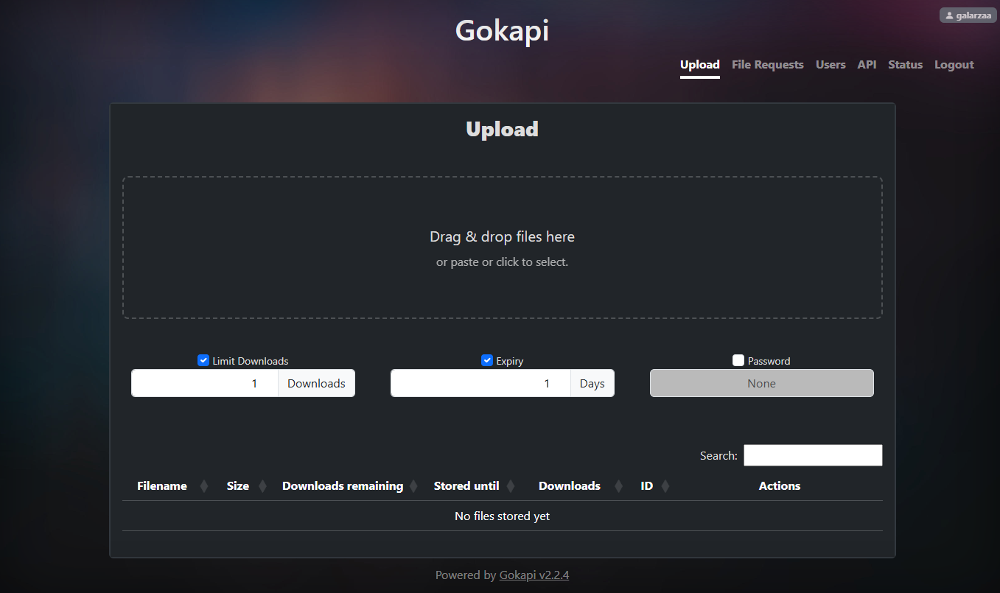
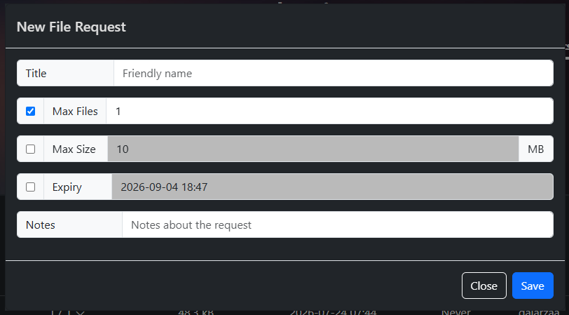

It's been a long time since I wrote a post and I know I have been missed (shhh, let me pretend I have an audience, okay? I already talk to myself, why not write to myself?). So today I have decided to continue with my series about tools or software that I like.

Today I'm here to present to you a little piece of software I found on [selfh.st](https://selfh.st/): :selfhst-gokapi: [Gokapi](https://github.com/Forceu/gokapi).

<!-- more -->

## The problem

At the time, I was working with some remote Windows machines. The only access I had to them was through a KVM over IP. It was my first time using a setup like this, and at first it was interesting: I could restart the machine, access the BIOS, and mess with network settings without losing access to the machine at all.

It was new to me. I was used to SSH, VNC, or RDP, where messing with networking could mean getting locked out of your machine. The novelty wore off pretty fast once I had to move files from my machine to the remote machine.

See, the thing is, the KVM gives me remote keyboard, video and mouse access to the machine, but it does not create a direct connection between my machine and the remote one. So it is not as simple as copying and pasting into an SSH session.

The specific KVM we were using (I'm not familiar with other brands, as this is the only time I have used one of these) offered two ways to transfer text:

1. **Paste text**: A text box where you can type in text or even paste text from your clipboard. Pressing Send would actually translate every character to keypresses on the keyboard, so some symbols might not work properly. Good for simple commands, definitely not a good idea for a script.
2. **Copy text**: Selecting this option would let you select an area on the screen, and the KVM would try to use OCR to detect text and copy it to your clipboard. Not very reliable, spaces and indentations would be very inconsistent, and depending on the font style and size, text might be misinterpreted.

You can see why that became annoying pretty fast?

## The solution

The first attempt to bridge the gap was using Google Drive to transfer files, but this brought more issues. I had to upload the files to Google Drive, create a sharing link, modify the permissions so everyone could access the files, and then use the KVM's tools to paste it. Why a public link? Because these machines were shared between us developers, so of course I wasn't comfortable logging in with my personal Google account (oh, did I mention we have no workspace accounts either?)

So, what does a normal person do in this situation? Probably just suck it up and deal with it, but if I was a normal person I wouldn't be writing this post, would I?

So I took a dive into [selfh.st](https://selfh.st/) and Reddit (the good old Google search: `<search term> reddit`). That's when I ran into [Gokapi](https://github.com/Forceu/gokapi), a self-hosted file transfer service. It had exactly what I needed, a simple web interface to upload files and get links to them, with options like download limits, expiration, and passwords.

It was a very quick setup. I decided to put it in my Remote Lab because I feel more comfortable keeping externally accessible services there. My Homelab, on the other hand, is behind Cloudflare Zero Trust.

The UI is pretty simple, just drag and drop files, get a link:

It also solved a problem I did not expect. Sometimes I needed to send files from the remote machine to my machine, such as logs. With Gokapi, you can create a file request link, then just paste that link on the remote machine, upload the files I needed and then download them on my machine.

## Final thoughts

There's always a sense of pride when you are able to set up a service to solve a problem you have. It has been a handy tool for me for sending and receiving files, without having to rely on public services, even when sharing something with family members who are not very tech-savvy.

Using my own service to share work files is still probably not the best idea. We were not given any company-provided tools for this, though, and the files were already being handled on our personal devices, so it felt like the most practical option at the time. Still, I would not recommend this for anyone else, as it could be a security risk.

I'm hoping I can share more tools in the future, so stay tuned for more posts in this series.